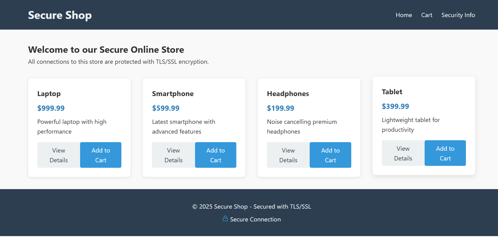

# Secure E-commerce Website with TLS/SSL

A demonstration project showing how to implement a secure Flask web application using TLS/SSL for encrypted communications.



## Features

- **TLS/SSL Encryption**: All communication is secured using TLS/SSL protocols
- **Self-signed Certificate Generation**: Automated certificate creation for development
- **Basic E-commerce Functionality**:
  - Product listings
  - Product detail pages
  - Shopping cart with session management
  - Secure checkout form
- **Security Information Display**: View details about your secure connection

## Prerequisites

- Python 3.7+
- pip package manager

## Installation

1. Clone the repository:
   ```bash
   git clone https://github.com/yourusername/secure-ecommerce.git
   cd secure-ecommerce
   ```

2. Install dependencies:
   ```bash
   pip install -r requirements.txt
   ```

## Running the Application

Simply run the main application file:

```bash
python app.py
```

The application will:
1. Check if SSL certificates exist
2. Generate self-signed certificates if none are found
3. Start a secure server at `https://localhost:5000`

## Project Structure

```
secure_ecommerce/
├── app.py              # Main Flask application
├── templates/          # HTML templates
│   ├── base.html
│   ├── index.html
│   ├── product.html
│   ├── cart.html
│   └── checkout.html
├── static/             # Static files
│   └── styles.css
├── generate_cert.py    # Script to generate SSL certificates
└── requirements.txt    # Project dependencies
```

## Security Notes

- This project uses **self-signed certificates** for demonstration purposes
- Your browser will display a security warning when accessing the site locally
- In production, you should use certificates from a trusted Certificate Authority

To manually generate new certificates:

```bash
python generate_cert.py
```

## Understanding TLS/SSL Implementation

This project demonstrates several key security concepts:

1. **SSL Context Creation**: Using Python's built-in `ssl` module to create a secure context
2. **Certificate Chain Loading**: Loading certificate and key files
3. **TLS Protocol Selection**: Using `ssl.PROTOCOL_TLS_SERVER` for secure communications
4. **Session Management**: Secure handling of user session data

## API Reference

### Routes

| Route | Method | Description |
|-------|--------|-------------|
| `/` | GET | Home page with product listings |
| `/product/<id>` | GET | View details for a specific product |
| `/add_to_cart/<id>` | GET | Add a product to the shopping cart |
| `/cart` | GET | View the shopping cart contents |
| `/checkout` | GET/POST | Secure checkout page and order processing |
| `/secure_info` | GET | View information about the secure connection |

## Development

### Modifying the Product Catalog

To add or modify products, edit the `products` list in `app.py`:

```python
products = [
    {"id": 1, "name": "Product Name", "price": 99.99, "description": "Product description"}
    # Add more products here
]
```

### Styling Changes

The project uses a custom CSS file located at `static/styles.css`. Modify this file to change the appearance of the site.

## Production Considerations

For a production environment:

1. **Use Proper Certificates**: Obtain certificates from a trusted Certificate Authority
2. **Implement HSTS**: Add HTTP Strict Transport Security headers
3. **Configure Proper Ciphers**: Set up secure cipher suites
4. **Regular Updates**: Keep dependencies updated for security patches
5. **Rate Limiting**: Implement rate limiting to prevent abuse
6. **Input Validation**: Add comprehensive input validation
7. **Database Security**: For a real database, ensure proper security measures

## Troubleshooting

### Certificate Issues

If you encounter certificate problems:

1. Delete existing `cert.pem` and `key.pem` files
2. Run `python generate_cert.py` to create new certificates
3. Restart the application

### Browser Warnings

Modern browsers will show a security warning for self-signed certificates:
- Click "Advanced" or "Details"
- Choose "Proceed to localhost (unsafe)" or similar option

## Acknowledgments

- Flask framework for web development
- PyOpenSSL for certificate generation
- Python's ssl module for TLS implementation

---

Created as a demonstration of implementing secure web communications with TLS/SSL in Python.
